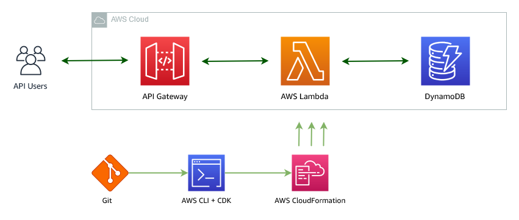

# Deploy a Serverless API in 30 mins

_Presented in Ep05 of the Coffee & Cloud Series_

Contact: https://linktr.ee/awsukstartups


## Objective

In this example, we will deploy a serverless Python function to API Gateway. The function will interact with a DynamoDB table for persistence.

The scenario is that we are building an dashboard app to show times when a train leaves a station heading to a destination. Each time a train departs we want to update our app to show the destination and the time that it departed.



## Requirements

- AWS Account
- AWS CLI installed & configured
- AWS CDK installed & configured
- Git CLI installed
- Docker installed
- Curl or Httpie installed (for testing)

## Expected Time

You should be able to deploy this in less than 30 mins.

## Getting Started

### 1. Initiate a new CDK application:

```bash
$ cdk init app --language typescript sample-api
$ cd sample-api
```

### 2. Add the CDK resources for the application

In the generated `lib/sample-api-stack.ts` add the DynamoDB Table, Lambda function & the API Gateway definition and allow the function to do read writes on the DynamoDB table.

```typescript
    const table = new Table(this, 'Table', {
      partitionKey: { type: AttributeType.STRING, name: 'id' },
    })

    const func = new PythonFunction(this, 'MyFunction', {
      entry: './lambda-api',
      runtime: Runtime.PYTHON_3_9,
      index: 'server.py',
      handler: 'handler',
      environment: {
        'TABLE_NAME': table.tableName
      }
    })

    new LambdaRestApi(this, 'RestAPI', {
      handler: func
    })

    table.grantReadWriteData(func)
```

_Note: For the full code see [lib/sample-api-stack.ts](./lib/sample-api-stack.ts)_

Note here we are using the `PythonFunction` construct here. This is a special construct that can perform a number of Python-based operations on your behalf. In this case, we want to include some Python libraries into our application.

The `PythonFunction` construct **requires that you have docker installed and accessible** before you can build and deploy your project.


### 3. Create your lambda function

Before we can deploy the CDK stack, we need to have the code ready for the function. A sample Python function has been provided in `lambda-api/`.

Copy the folder `lambda-api/` to your application. Make sure you have `Pipenv`, `Pipenv.lock` & `server.py` in the folder.


### 4. Deploy our Lambda API

Now that everything is prepared, we can deploy our application to AWS using the CDK CLI.

```bash
$ cdk deploy
```

When this operation is complete you'll see a API Gateway URL displayed. This is your new API endpoint!!


### 5. Test our API

Now we need to test the functionality of your new API.

In our hypothetical example, when a train departs a station we call a POST operation to the `/update` endpoint:

```bash
$ http POST https://9vszbm10h9.execute-api.eu-west-1.amazonaws.com/prod/update
{
  "new_departure": "Edinburgh",
  "time": "18:46"
}
```

We can then retrieve the last departed train and the time that it departed using the `/last_departed` endpoint:

```bash
$ http GET https://9vszbm10h9.execute-api.eu-west-1.amazonaws.com/prod/last_departed
{
  "departure_time": "18:46",
  "last_departed": "Edinburgh"
}
```


That's it! You've now deployed a serverless Python API to API Gateway!


## Clean Up

If you want to remove the resources for this sample. Use the AWS CDK as follows:


```bash
$ cdk destroy
```
